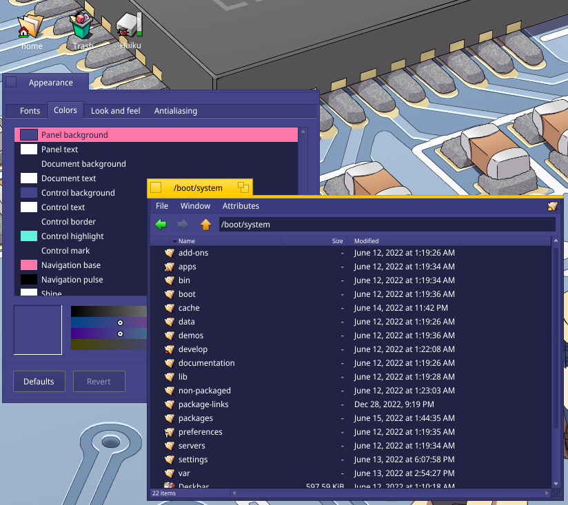

# loopy-haiku
An adaptation of [loopy-desktop](https://github.com/kokoscript/loopy-desktop)'s theme for the Haiku operating system.

## Installation
1. Install 'Theme Manager' and 'Haiku Extras' from HaikuDepot.
2. In `/boot/home/config/settings/UIThemes`, create a directory named `Loopy`.
3. Move the `Theme` file from this repository into that directory.
4. Open Theme Manager, select the theme, and apply it!
